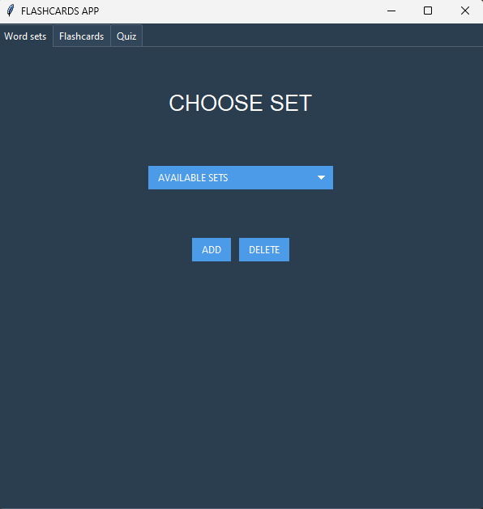
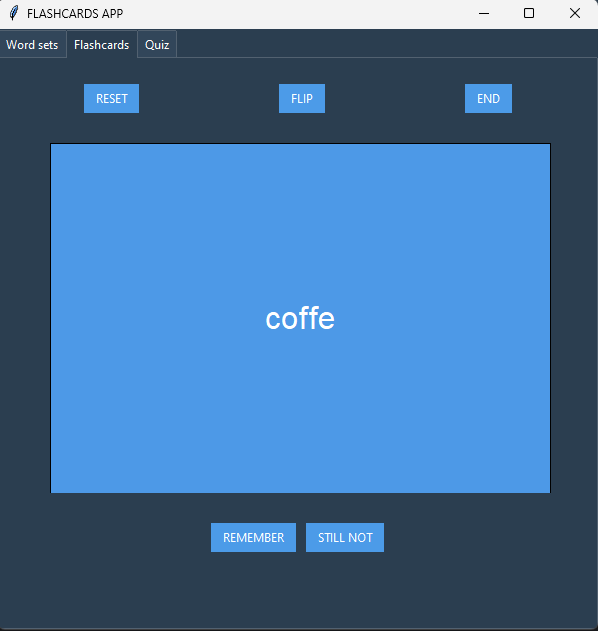
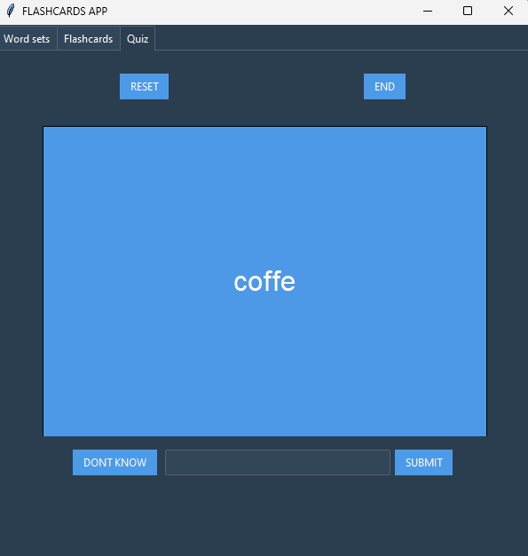

# **FLASHCARDS APP**

# **Required:**
    tkinter and ttkbootstrap

# **Description:**

    Flashcards App is a simple application built with Python and the Tkinter library. 
    It allows users to create, manage, and study sets of flashcards for language learning. 
    So far, the implemented languages English and Polish.

# **Video Demo:**

    https://www.youtube.com/watch?v=g7YWqHqqfNY

# **Functionality:** 

The app provides three main modes:

# **1. Flashcards** 

RESET  

    Resets the current flashcards session, allowing the user to start over with the selected set.

FLIP 

    Toggles between displaying English and Polish translations of the current word on the flashcard.

END 

    Ends the current flashcards session. 

REMEMBER

    Marks the current word as remembered and moves to the next word in the set.

STILL NOT

    Marks the current word as not remembered and moves to the next word in the set.

# **2. Quiz**

RESET 

    Resets the current quiz session, allowing the user to start over with the selected set.
    
END 

    Ends the current quiz session.
    
DONT 

    KNOW Marks the current word as not remembered and moves to the next word in the quiz set.
    
SUBMIT 

    Submits the entered Polish translation. If correct, marks the word as remembered and moves to the next word. If incorrect, provides feedback.

# **3. Word sets manager**

ADD 

    Opens a dialog to create a new word set. After entering the set name, it askes about inputing English word and it's Polish translation as many times as user do not click save set button. 
    Then set is added to the list of available sets, and a CSV file with that set is created.

DELETE 

    Removes the selected set. The CSV file with set is deleted, and the set is removed from the list of available sets. If a flashcards or quiz session is ongoing, it is ended.

# Explanation of functions

# def main():

    Initializes the main application window with tabs for word sets, flashcards, and quiz.
    Uses global variables for settings and selected sets.
    
#   def center_window(window, width, height):

    Centers a window on the screen based on its width and height.

#   def read_set_names():
      

    Reads available word set names from a file and returns a list.
    
#   def read_set(set_name):
       

    Reads a word set from a CSV file and returns a list of word pairs (English and Polish).
    
#   def add_word_set():
       

    Opens a dialog to add a new word set.
    Asks for a set name, updates the available sets list, and creates an empty CSV file for the new set.
    
#   def display_canvas(selected_type, set, current_word):
     

    Displays the current word on the canvas based on the selected mode (flashcards or quiz).
    
#   def refresh_canvas(selected_type):
       

    Resets the session, updating the canvas for the selected mode.
    
#   def reset_canvas(selected_type):
       

    Resets the session and canvas to the original state for the selected mode.
    
#   def remember_word(selected_type, current_word, set, remembered_words):
       

    Marks the current word as remembered, updates the session, and moves to the next word.
    
#   def not_remember_word(selected_type, current_word, set, non_remembered_words):
       

    Marks the current word as not remembered, updates the session, and moves to the next word.
    
#   def end_of_set_popup(selected_type, non_remembered_words):
       

    Displays a popup at the end of a set, allowing the user to change the set based on non-remembered words.
    
#   def change_set_to_non_remembered(selected_type):
       

    Changes the current set to include only non-remembered words for the selected mode.
    
#   def end_section(selected_type):
       

    Ends the current section (flashcards or quiz) and resets relevant variables.

#   def create_word_sets_frame(notebook, style):
       

    Creates the Word Sets tab with options to choose, add, and delete word sets.
    
#   def on_set_selected(set_name):
       

    Updates the selected word set based on the chosen set name.
    
#   def update_word_sets_menu():
     

    Updates the menu with the available word sets.

#   def ask_for_translations(set_name):
    

    Opens a dialog to input English and Polish translations for a new word set.

#   def delete_selected_set():
       

    Deletes the selected word set, removes its CSV file, and updates the available sets list.

#   def create_flashcards_frame(notebook, style):
       

    Creates the Flashcards tab with buttons to reset, flip, end, remember, and not remember words.
    
#   def flip_flashcards():
       

    Toggles the is_flipped variable and displays the flipped word on the canvas.

#   def create_quiz_frame(notebook, style):
       

    Creates the Quiz tab with buttons to reset, end, remember, and submit translations.
    
#   def submit_translation():
       

    Checks if the entered translation is correct and updates the session accordingly.

